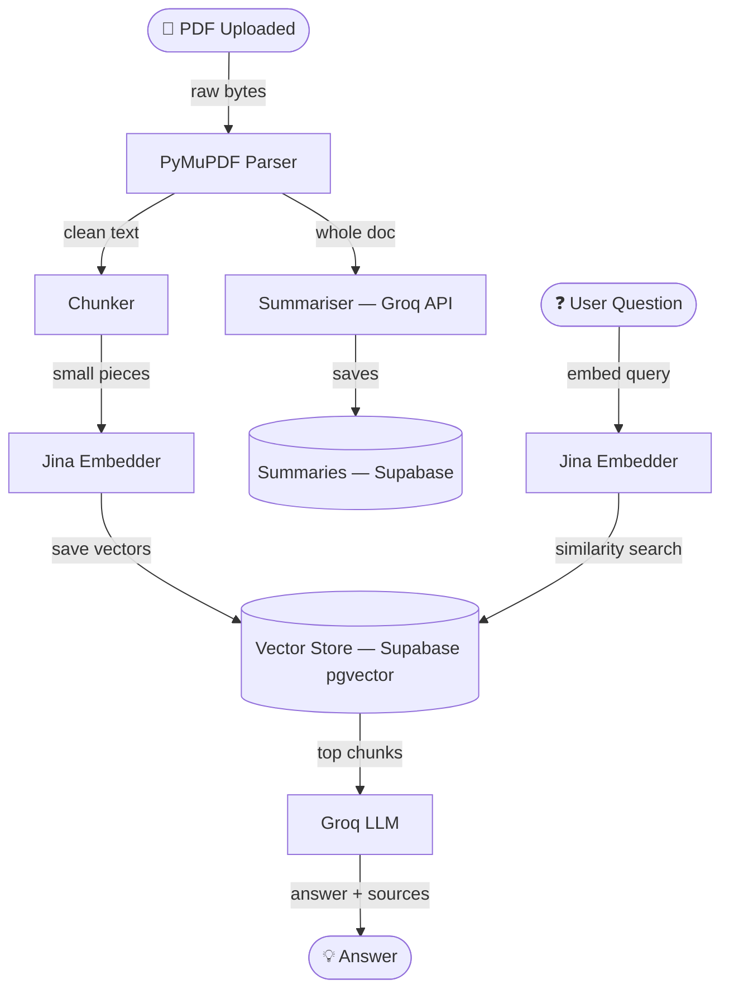

# PolicyLens — RAG Engine & API

**PolicyLens** is an AI-powered insurance policy analysis platform. This repository contains the **RAG Engine and FastAPI backend** that powers the core intelligence — upload any PDF policy document and IRIS instantly parses, indexes, and lets you query it in plain English.

> The React frontend and Node.js auth/proxy backend are maintained separately by teammates and are not documented here.

---

## RAG Pipeline



---

## Features

- **PDF Parsing** — PyMuPDF local parser (~0.2s), no cloud OCR dependency. Optional LlamaParse fallback via `USE_LLAMAPARSE=true`
- **Semantic Chunking** — Page-boundary-aware chunker (~31 chunks per 20-page doc)
- **Jina Embeddings v3** — 768-dim vectors, batched for efficiency
- **Vector Store** — Supabase pgvector with cosine similarity search
- **CrossEncoder Reranking** — BGE reranker re-scores retrieved chunks for precision
- **Auto Summary** — Structured policy summary generated on upload (coverage, exclusions, premiums, benefits)
- **Streaming Chat** — IRIS chat powered by Groq API with full document context
- **Chat History** — All conversations persisted in Supabase per user per policy

---

## Tech Stack

| Layer | Technology |
|---|---|
| API Framework | Python 3.11, FastAPI, Uvicorn |
| PDF Parsing | PyMuPDF / pymupdf4llm (local) |
| Embeddings | Jina Embeddings v3 API (768-dim) |
| Vector Store | Supabase pgvector |
| Reranker | sentence-transformers CrossEncoder (BGE) |
| LLM | Groq API |
| Database | Supabase (PostgreSQL) |

---

## Project Structure

Only the parts I built are documented below.

```
policylens/
├── api/                          # FastAPI app
│   ├── main.py                   # App entry, lifespan, CORS setup
│   └── routes/
│       ├── ingest.py             # POST /ingest/upload, GET /ingest/status/:id, GET /ingest/summary/:id
│       ├── query.py              # POST /query (stream + non-stream)
│       └── health.py             # GET /health
│
├── rag_engine/                   # Core RAG logic
│   ├── ingestion/
│   │   ├── pdf_loader.py         # PyMuPDF parser (LlamaParse optional fallback)
│   │   ├── cleaner.py            # Text normalisation
│   │   ├── chunker.py            # Semantic chunking with page boundary tracking
│   │   └── pipeline.py           # Orchestrates load → clean → chunk
│   ├── embeddings/
│   │   ├── jina_embedder.py      # Jina v3 API (default, 768-dim)
│   │   └── local_embedder.py     # BGE local fallback (CPU)
│   ├── vector_store/
│   │   └── supabase_store.py     # pgvector upsert + similarity search
│   ├── retrieval/
│   │   ├── retriever.py          # k-NN vector search
│   │   ├── reranker.py           # CrossEncoder reranker
│   │   ├── context_builder.py    # Builds prompt context from chunks
│   │   └── query_preprocessor.py
│   ├── llm/
│   │   └── groq_llm.py           # Groq API client (stream + complete)
│   ├── services/
│   │   ├── ingestion_service.py  # End-to-end ingest orchestration
│   │   ├── query_service.py      # End-to-end query + streaming
│   │   └── summary_service.py    # Auto policy summary on upload
│   ├── prompts/                  # System prompts, query templates, response formatter
│   ├── config/
│   │   └── settings.py           # Pydantic settings (reads .env)
│   └── utils/
│       ├── status_tracker.py     # In-memory ingestion progress tracker
│       ├── retry.py              # Exponential backoff decorator
│       └── logger.py
│
├── supabase_migrations/          # SQL files — run in order (001 → 005)
├── .env.example
├── requirements.txt
├── Dockerfile
└── docker-compose.yml

# frontend/   → React 19 + Vite (teammate)
# backend/    → Node.js + Express auth/proxy (teammate)
```

---

## Ingestion Pipeline

```
PDF Upload
  ↓
PyMuPDF (local, ~0.2s)          ← set USE_LLAMAPARSE=true for cloud fallback
  ↓
Text Cleaner
  ↓
Semantic Chunker (~31 chunks per 20-page doc)
  ↓
Jina Embeddings v3 (768-dim, batches of 100)
  ↓
Supabase pgvector (batch upsert)
  ↓
Auto Summary (Groq API, top-15 chunks)
  ↓
Status → "ready"
```

---

## Query Pipeline

```
User Question
  ↓
Query Preprocessor
  ↓
Jina embed_query (single vector)
  ↓
pgvector similarity_search (k=8)
  ↓
CrossEncoder Reranker (top 5)
  ↓
Context Builder (~3400 tokens)
  ↓
Groq LLM (stream or complete)
  ↓
Response + Sources
```

---

## Local Setup

### Prerequisites
- Python 3.11+
- A [Supabase](https://supabase.com) project with pgvector enabled
- [Jina AI](https://jina.ai) API key (free tier available)
- [Groq](https://console.groq.com) API key (free tier available)

### 1. Supabase — Run Migrations

In your Supabase project → **SQL Editor**, run the files in `supabase_migrations/` in order from `001` to `005`.

### 2. Python RAG Engine

```bash
pip install -r requirements.txt
cp .env.example .env
```

Edit `.env`:

```env
GROQ_API_KEY=your_groq_api_key
SUPABASE_URL=https://xxxx.supabase.co
SUPABASE_SERVICE_KEY=your_service_role_key

EMBEDDING_PROVIDER=jina
JINA_API_KEY=jina_xxxxxxxxxxxxxxxx

# Optional — only needed if USE_LLAMAPARSE=true
LLAMA_CLOUD_API_KEY=not_used
USE_LLAMAPARSE=false
```

Start the server:

```bash
python -m uvicorn api.main:app --host 0.0.0.0 --port 8000 --reload
```

✅ Running at `http://localhost:8000`

---

## API Reference

> All routes are served directly by FastAPI on port `8000`. In the full platform, Node.js proxies these under `/api/*`.

### Ingest

| Method | Endpoint | Description |
|---|---|---|
| POST | `/ingest/upload` | Upload PDF, starts background ingestion |
| GET | `/ingest/status/:policy_id` | Poll ingestion progress (0–100%) |
| GET | `/ingest/summary/:policy_id` | Get structured policy summary |

### Query

| Method | Endpoint | Description |
|---|---|---|
| POST | `/query` | Single-turn RAG query, body: `{ question, policy_id }` |
| POST | `/query/stream` | Streaming token response |

### Health

| Method | Endpoint | Description |
|---|---|---|
| GET | `/health` | Health check |

---

## Environment Variables

| Variable | Required | Description |
|---|---|---|
| `GROQ_API_KEY` | ✅ | Groq API key |
| `SUPABASE_URL` | ✅ | Supabase project URL |
| `SUPABASE_SERVICE_KEY` | ✅ | Supabase service role key |
| `JINA_API_KEY` | ✅ | Jina AI API key |
| `EMBEDDING_PROVIDER` | ✅ | `jina` or `local` |
| `USE_LLAMAPARSE` | ❌ | Set `true` to use LlamaParse instead of PyMuPDF |
| `LLAMA_CLOUD_API_KEY` | ❌ | Only if `USE_LLAMAPARSE=true` |
| `DEBUG` | ❌ | `true` for verbose logs |
